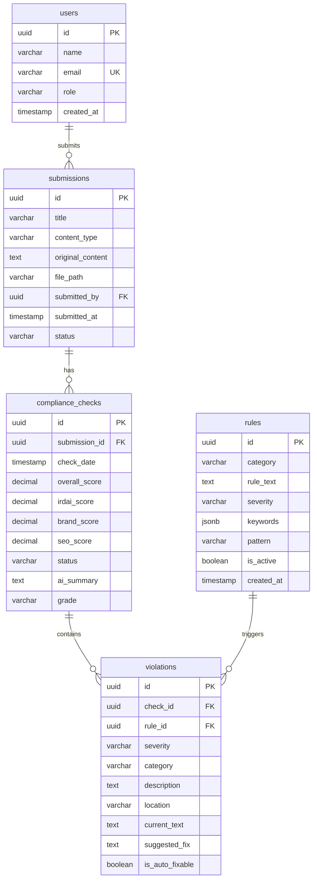

# Project Understanding: Compliance Agent POC

> **Last Updated**: 2025-12-05  
> **Purpose**: AI-powered compliance checking system for insurance marketing content

---

## Overview

This is a **Compliance Agent POC (Proof of Concept)** that automatically checks marketing content against **IRDAI (Insurance Regulatory and Development Authority of India) regulations** and **Bajaj Life Insurance brand guidelines**. It uses **Ollama LLM** for AI-powered analysis.

### Core Workflow
```
User uploads content → AI analyzes for compliance → Generates violations/scores → User reviews results
```

---

## Architecture

### Tech Stack
| Layer | Technology |
|-------|------------|
| **Backend** | FastAPI (Python 3.11), PostgreSQL 15, Redis 7 |
| **Frontend** | React 18 + TypeScript, Vite 5, Tailwind CSS |
| **AI/LLM** | Ollama (qwen2.5:7b model) |
| **ORM** | SQLAlchemy 2.0 + Alembic migrations |
| **Containerization** | Docker + Docker Compose |

---

## Database Schema



### Key Tables
| Table | Purpose |
|-------|---------|
| `users` | Store user accounts (agents) |
| `submissions` | Content uploaded for compliance checking |
| `compliance_checks` | Results of AI compliance analysis |
| `rules` | Compliance rules (IRDAI, Brand, SEO) |
| `violations` | Specific rule violations found in content |

---

## Backend Structure

```
backend/app/
├── main.py              # FastAPI application entry
├── config.py            # Environment configuration
├── database.py          # SQLAlchemy database connection
├── models/              # SQLAlchemy ORM models
│   ├── user.py          # User model
│   ├── submission.py    # Submission model
│   ├── compliance_check.py
│   ├── violation.py
│   └── rule.py
├── schemas/             # Pydantic request/response schemas
├── services/            # Business logic
│   ├── ollama_service.py      # LLM integration ⭐
│   ├── compliance_engine.py   # Core compliance logic ⭐
│   ├── content_parser.py      # File parsing (HTML/MD/PDF/DOCX)
│   └── scoring_service.py     # Score calculation
├── api/routes/          # API endpoints
└── seed_data.py         # Initial compliance rules
```

### Key Services

#### 1. OllamaService (`ollama_service.py`)
- Integrates with Ollama LLM via HTTP API
- Supports chat and generate APIs
- Retry mechanism with exponential backoff
- Fallback response when unavailable

#### 2. ComplianceEngine (`compliance_engine.py`)
- Core analysis workflow:
  1. Load submission content
  2. Fetch active rules from database
  3. Build compliance prompt
  4. Send to Ollama for analysis
  5. Parse AI response
  6. Calculate scores
  7. Store violations

#### 3. ScoringService (`scoring_service.py`)
- Weighted scoring algorithm:
  - **Critical violation**: -20 points
  - **High severity**: -10 points
  - **Medium severity**: -5 points
  - **Low severity**: -2 points
- Overall score = (IRDAI × 50%) + (Brand × 30%) + (SEO × 20%)
- Grading: A (90-100), B (80-89), C (70-79), D (60-69), F (<60)

---

## Frontend Structure

```
frontend/src/
├── App.tsx              # Main app with routing
├── main.tsx             # Entry point
├── pages/
│   ├── Dashboard.tsx    # Overview stats and charts
│   ├── Upload.tsx       # Content upload interface
│   ├── Submissions.tsx  # List of all submissions
│   └── Results.tsx      # Compliance check results
├── components/          # Reusable UI components
├── lib/
│   ├── api.ts           # Axios API client
│   ├── types.ts         # TypeScript interfaces
│   └── utils.ts         # Utility functions
└── index.css            # Global styles
```

### Key Pages
| Page | Route | Purpose |
|------|-------|---------|
| Dashboard | `/` | Stats overview, recent activity |
| Upload | `/upload` | File upload + compliance check trigger |
| Submissions | `/submissions` | List all uploaded content |
| Results | `/results/:id` | Detailed compliance results |

---

## API Endpoints

### Submissions
| Method | Endpoint | Description |
|--------|----------|-------------|
| POST | `/api/submissions/upload` | Upload content file |
| GET | `/api/submissions` | List all submissions |
| GET | `/api/submissions/{id}` | Get submission details |
| POST | `/api/submissions/{id}/analyze` | Trigger compliance analysis |

### Compliance
| Method | Endpoint | Description |
|--------|----------|-------------|
| GET | `/api/compliance/{submission_id}` | Get compliance results |
| GET | `/api/compliance/{submission_id}/violations` | Get violations only |

### Dashboard
| Method | Endpoint | Description |
|--------|----------|-------------|
| GET | `/api/dashboard/stats` | Dashboard statistics |
| GET | `/api/dashboard/recent` | Recent submissions |

---

## Compliance Rules (Pre-seeded)

### IRDAI Rules (5)
1. No misleading claims about returns/guarantees
2. Proper risk disclosures required
3. No medical condition misrepresentation
4. Factual competitor comparisons only
5. Clear fee disclosure required

### Brand Rules (4)
1. Use of full company name
2. Prohibited words avoidance
3. Professional tone and voice
4. Visual guidelines compliance

### SEO Rules (4)
1. Title length optimization (50-60 chars)
2. Meta description presence
3. Keyword placement (H1, first paragraph)
4. Image alt text requirements

---

## Running the Project

```bash
# Start all services
docker-compose up -d

# Pull AI model
docker-compose exec ollama ollama pull qwen2.5:7b

# Run migrations
docker-compose exec backend alembic upgrade head

# Seed database
docker-compose exec backend python -m app.seed_data
```

### Access Points
- **Frontend**: http://localhost:5173
- **API Docs**: http://localhost:8000/docs
- **Health Check**: http://localhost:8000/health

---

## Change Log

| Date | Change | Files Affected |
|------|--------|----------------|
| 2025-12-05 | Initial project understanding document created | `PROJECT_UNDERSTANDING.md` |

---

## Known Limitations (MVP)

1. No authentication (all users same access)
2. Synchronous analysis (no background queue)
3. Content truncated to first 3000 characters
4. 50MB max file upload
5. No real-time updates (manual refresh needed)

---

## Future Roadmap

- [ ] JWT authentication
- [ ] Celery for async processing
- [ ] WebSocket real-time updates
- [ ] Rule management UI
- [ ] CMS integrations
- [ ] Multi-language support
