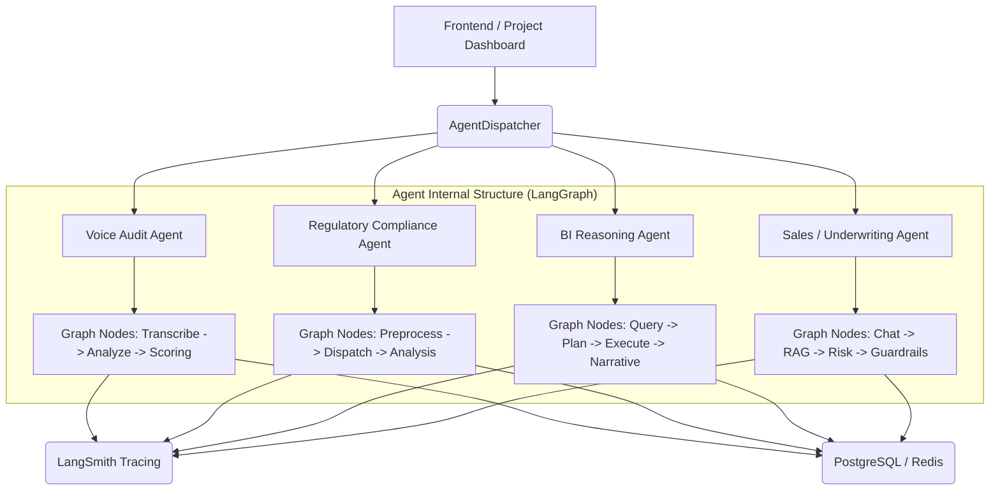

# Compliance Agent Platform - Multi-Agent Architecture

## Vision

A unified compliance and sales ecosystem powered by specialized AI agents. This platform moves beyond simple document checking into voice audit, real-time sales assistance, and deep BI reasoning—all integrated within a common "Project" framework.

## Multi-Agent Architecture

The system uses an **AgentDispatcher** to route requests to specialized agents. Each agent follows a consistent **LangGraph-based orchestration** pattern for observability, persistence, and human-in-the-loop (HITL) capabilities.

## Agent Missions

### 1. Voice Audit Agent

- **Focus**: Transcribing call recordings and detecting IRDAI violations (e.g., guaranteed returns, pressure tactics).
- **Stack**: Whisper/AssemblyAI, spaCy, LangGraph.
- **Integration**: Upload audio within a project to get a compliance score for the call.

### 2. Regulatory Compliance Agent (Existing)

- **Focus**: Analyzing marketing content (text/images) against IRDAI and Brand rules.
- **Stack**: Gemini-1.5, LangGraph, Redis.
- **Integration**: Core document submission flow.

### 3. BI Reasoning Agent

- **Focus**: "Reasoning Loops" over compliance data to detect trends and anomalies.
- **Stack**: SQL Agent, LangChain, Executive Narrative generation.
- **Integration**: Analytics tab within a project.

### 4. Sales & Underwriting Agent

- **Focus**: Bilingual (English/Hindi) chat with real-time risk assessment via RAG.
- **Stack**: Vector DB (FAISS/Pinecone), Bilingual LLMs, LangGraph.
- **Integration**: Customer-facing widget or "Sales Sandbox" in the dashboard.

## Project Integration Strategy

Everything is scoped to a **Project**. A project defines:

1. **Guidelines**: The rules that apply to all content within it.
2. **Context**: Industry, brand name, and custom requirements.
3. **Agent Settings**: Specific configurations for each of the 4 agents.

### Adding Agents to a Project

Users can toggle which agents are active for a specific project.

- A "Claims Project" might only need the Voice Audit and Compliance agents.
- A "Sales Coaching Project" might focus on the Sales and BI agents.

## Getting Started

### Backend

1. Clone the repo and install dependencies: `pip install -r requirements.txt`
2. Set up `.env` with `GOOGLE_API_KEY`, `LANGCHAIN_API_KEY`, and database credentials.
3. Run the server: `uvicorn app.main:app --reload`

### Frontend (v3)

1. Navigate to `/frontendv3`.
2. Install: `pnpm install`
3. Run: `pnpm dev`

## Observability

All agents are traced via LangSmith. Use the `X-User-Id` header to track execution sessions.
