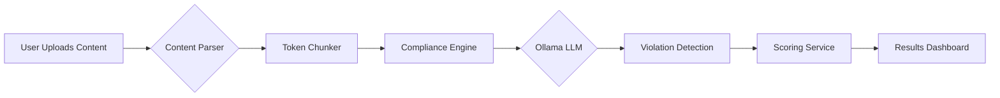
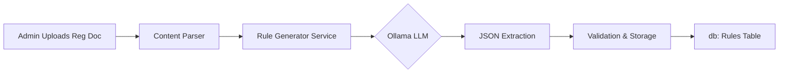

# Compliance Agent POC

> **AI-Powered Compliance Automation for Insurance Marketing**

The **Compliance Agent POC** is an advanced, AI-driven system designed to automate the validation of marketing content against regulatory standards (IRDAI), brand guidelines, and SEO best practices. By leveraging local LLMs (Ollama/Qwen) and precise token-based chunking, it delivers accurate, context-aware compliance checks and actionable fix suggestions.

---

## 🚀 Key Features & Capabilities

### 1. Intelligent Compliance Analysis (Phase 1)
- **Multi-Dimensional Scoring**: Evaluates content across **IRDAI Regulations** (50%), **Brand Guidelines** (30%), and **SEO Standards** (20%).
- **AI-Powered Violation Detection**: Goes beyond keyword matching to understand context and intent using the `qwen2.5:7b` model.
- **Automated Fix Suggestions**: Provides rewritten content snippets to resolve specific violations.
- **Support for Multiple Formats**: PDF, DOCX, HTML, and Markdown.

### 2. Dynamic Rule Management (Phase 2 - Admin)
- **Rule Generation from Documents**: Super Admins can upload regulatory PDFs/DOCs, and the system automatically extracts and structures new compliance rules.
- **Admin Dashboard**: A dedicated interface to view, edit, search, and manage rules.
- **Configurable Scoring**: Fine-tune point deductions (e.g., -20 for Critical) directly from the dashboard without code changes.

### 3. Advanced Content Processing
- **Token-Based Chunking**: Replaced character-based splitting with a robust token-aware system (via `tiktoken`/`transformers`) to ensure optimal LLM context window usage and semantic preservation.
- **Page-Aware Processing**: Tracks PDF page numbers for precise violation attribution.

---

## 🔄 Core Workflows

### Workflow 1: Compliance Analysis (User Flow)

1. **Upload**: User uploads a file (PDF/DOCX/HTML).
2. **Chunking**: System splits text into token-optimized chunks (default 900 tokens) with overlap to preserve context.
3. **Analysis**: Each chunk is analyzed by the LLM against active rules.
4. **Aggregation**: Violations and scores are aggregated to generate a final Report Card and Grade (A-F).

### Workflow 2: Dynamic Rule Generation (Admin Flow)

1. **Upload**: Admin uploads a new guideline document (e.g., "New IRDAI 2025 Specs").
2. **Extraction**: LLM processes the text to identify constraints and requirements.
3. **Structured Output**: Extracts rules with `category`, `severity`, `keywords`, and `points_deduction`.
4. **Storage**: Validated rules are saved to the database and become immediately active for future checks.

---

## 🏗 System Architecture

The system follows a modern, containerized microservices architecture.

### Technology Stack
| Component | Technology | Description |
|-----------|------------|-------------|
| **Frontend** | React 18, TypeScript, Tailwind | Responsive dashboard and admin UI |
| **Backend** | FastAPI (Python 3.11) | High-performance async API |
| **Database** | PostgreSQL 15 | Relational data + JSONB for flexible storage |
| **Vector/AI** | Ollama (Qwen 2.5) | Local LLM inference engine |
| **Caching** | Redis 7 | Session storage and caching |
| **Processing** | Tiktoken, SpaCy | NLP and tokenization utilities |
| **Infra** | Docker Compose | Orchestration and deployment |

### Directory Structure
```
compliance-agent-poc/
├── backend/
│   ├── app/
│   │   ├── services/           # Core business logic
│   │   │   ├── compliance_engine.py  # Analysis orchestrator
│   │   │   ├── rule_generator.py     # Rule extraction (Phase 2)
│   │   │   ├── preprocessing.py      # Token chunking logic
│   │   │   └── ollama_service.py     # LLM interface
│   │   ├── api/                # REST endpoints
│   │   └── models/             # SQLAlchemy schemas
├── frontend/
│   ├── src/
│   │   ├── pages/              # UI Pages (Dashboard, Admin, Results)
│   │   ├── components/         # Reusable UI elements
│   │   └── lib/                # API clients and types
├── docker-compose.yml          # Service definition
└── PHASE2_SUMMARY.md           # Detailed Phase 2 docs
```

---

## 💻 Getting Started

### Prerequisites
- Docker Desktop installed
- Git
- 8GB+ RAM (Recommended for LLM)

### Installation & Run
1. **Clone the repository**:
   ```bash
   git clone <repo-url>
   cd compliance-agent-poc
   ```

2. **Start Services**:
   ```bash
   docker-compose up -d
   ```

3. **Initialize System** (First run only):
   ```bash
   # Pull the AI Model
   docker-compose exec ollama ollama pull qwen2.5:7b

   # Run DB Migrations
   docker-compose exec backend alembic upgrade head

   # Seed Default Rules & Super Admin
   docker-compose exec backend python -m app.seed_data
   ```

4. **Access the Application**:
   - **Frontend**: [http://localhost:5173](http://localhost:5173)
   - **Admin Dashboard**: [http://localhost:5173/admin](http://localhost:5173/admin)
   - **API Docs**: [http://localhost:8000/docs](http://localhost:8000/docs)

---

## 📚 Documentation Index

For deeper dives into specific components, refer to these documents:

- **[PROJECT_UNDERSTANDING.md](PROJECT_UNDERSTANDING.md)**: Master document detailing the entire system, database schema, and API contracts.
- **[PHASE2_SUMMARY.md](PHASE2_SUMMARY.md)**: Specific details on the Dynamic Rule Generation and Admin Dashboard implementation.
- **[TOKEN_BASED_CHUNKING.md](TOKEN_BASED_CHUNKING.md)**: Technical deep-dive into the tokenization and chunking algorithms.
- **[plan.md](plan.md)**: Original implementation plan and architectural decisions.

---

## 🛡 Security & Role-Based Access (POC)

- **Agent**: Can upload and analyze submissions.
- **Super Admin**: Has full access to the **Admin Dashboard** to generate, edit, and delete rules.
- **Authentication**: Currently uses header-based auth (`X-User-Id`) for the POC.

## 🔮 Future Roadmap

- [ ] **Auth**: Implementation of JWT/OAuth2.
- [ ] **Async Processing**: Celery integration for handling large document queues.
- [ ] **Real-Time**: WebSocket updates for analysis progress.
- [ ] **Governance**: Audit trails for rule changes and deeper compliance reporting.
