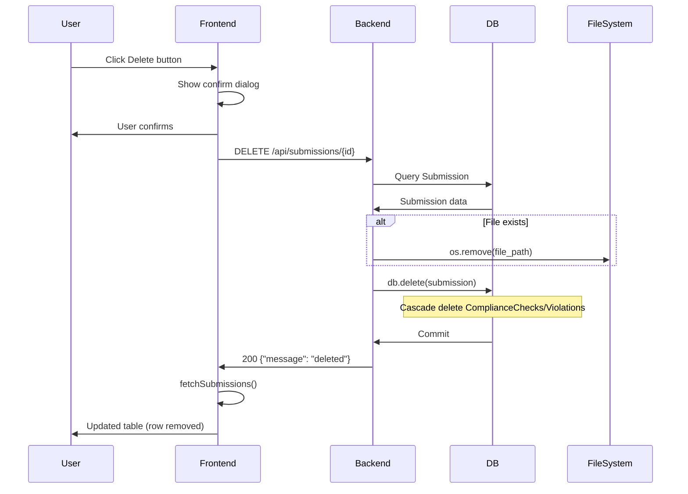

# Submissions Delete Feature Documentation

## Overview
The delete functionality allows users to remove submissions from the `/submissions` page. It includes:
- Backend: DELETE `/api/submissions/{id}` endpoint deletes DB record (cascades [`ComplianceCheck`](backend/app/models/compliance_check.py) and related violations), removes uploaded file.
- Frontend: Red "Delete" button in table Actions column, confirm dialog, loading state ("Deleting..."), refreshes list.

## Backend Implementation
**File:** [`backend/app/api/routes/submissions.py`](backend/app/api/routes/submissions.py)

**Endpoint:** `@router.delete("/{submission_id}")`
- Finds submission by UUID.
- Deletes file at `submission.file_path` if exists (using `os.remove`).
- `db.delete(submission)`; cascade deletes related checks/violations.
- Returns `{"message": "Submission deleted successfully"}`.

**Model:** [`backend/app/models/submission.py`](backend/app/models/submission.py)
- `compliance_checks = relationship("ComplianceCheck", back_populates="submission", cascade="all, delete-orphan")`

**Schema:** No new schema; uses existing.

## Frontend Implementation
**API Client:** [`frontend/src/lib/api.ts`](frontend/src/lib/api.ts)
```
deleteSubmission: (id: string) => apiClient.delete(`/api/submissions/${id}`)
```

**UI:** [`frontend/src/pages/Submissions.tsx`](frontend/src/pages/Submissions.tsx)
- Table row Actions column: Always-visible Delete button.
- `handleDelete(id)`: `confirm()` → `api.deleteSubmission(id)` → `fetchSubmissions()`.
- Loading: `actionLoading: Record<string, boolean>`, button disabled + "Deleting..." during call.

## Flow Diagram


## Testing
1. Upload content → Analyze → Go to http://localhost:5173/submissions.
2. Click Delete → Confirm → Row disappears, status updates to "analyzing" during (if stuck).
3. Verify DB: No submission record.
4. Verify uploads dir: File gone.

**Edge Cases:**
- Non-existent ID: 404.
- No file: Skips remove.
- Analyzing status: Deletes anyway (cleans stuck tasks).

## Related Files
- Models: [`submission.py`](backend/app/models/submission.py), [`compliance_check.py`](backend/app/models/compliance_check.py)
- Schemas: [`submission.py`](backend/app/schemas/submission.py)
- Types: [`types.ts`](frontend/src/lib/types.ts) Submission interface